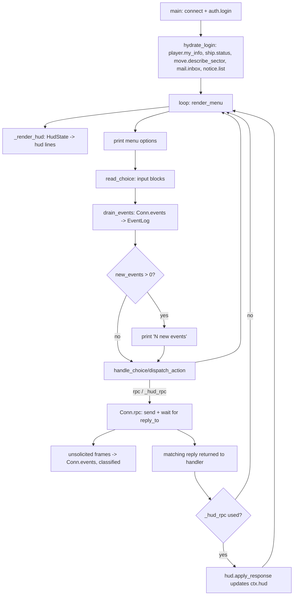

# Python Client Development Handover

**Status:** authoritative continuation document for `client/python_client/`.
**Rule:** every future Python-client slice must update this handover in the
same change set. Work is not complete until architecture, behaviour, tests,
known limitations and the continuation backlog reflect the resulting
repository state.

---

## 1. Purpose and scope

`client/python_client/client.py` (plus its extracted modules) is a
socket-based, menu-driven, keyboard-led terminal client for the TWClone
server. It is the reference implementation used to validate the real
client/server contract before that contract is reused by a future
C/ncurses client and a future Godot client.

Governing principles for all work in this directory:

* **Implementation is authoritative.** The command registry in
  `src/server_loop.c`, the handlers it dispatches to, and passing
  integration/unit evidence outrank draft protocol documents. Where a draft
  document (e.g. anything marked DRAFT) and the running server disagree,
  the server wins and the disagreement must be recorded, not silently
  resolved by picking the draft.
* **Protocol/domain state must stay independent of rendering.** Modules
  that parse server responses or hold session state must not `print()`,
  and modules that render text must not perform RPCs. This is enforced by
  `client/python_client/tests/test_architecture.py`.
* **No shared Python UI code with future clients.** The C/ncurses and
  Godot clients will talk to the same server protocol, but they will not
  import or embed this Python UI. What *is* meant to be reused is the
  **behavioural specification**: which commands exist, what payloads they
  need, how responses map to state, the HUD field model, the event
  classification vocabulary, and the navigation/interaction conventions
  documented here and in `docs/reports/python-client-ux-audit.md`.
* **UX direction.** This is a keyboard-led space-trading game interface,
  not a generic administrative/web dashboard. Menus, single-key choices,
  and terse status lines are the intended idiom; do not introduce forms,
  dashboards, or mouse-first patterns.

---

## 2. Repository map

All paths below are relative to `client/python_client/`.

| File | Responsibility |
|---|---|
| `client.py` | Orchestration layer: CLI parsing, `main()` (connect/login/hydrate), the menu engine (`render_menu`, `handle_choice`, `dispatch_action`), and every `@register`-decorated handler/flow. This is the only module that is allowed to combine RPCs, state mutation, and rendering in one place — everything it does should ultimately delegate parsing/formatting to the other modules below. |
| `protocol.py` | Transport layer. `Conn` owns the socket, `send`/`recv`/`rpc`, session-token injection, and the bounded `EventQueue` (`Conn.events`) that unsolicited frames are pushed onto. Also holds the pure envelope helpers `get_data`, `extract_current_sector`, `normalize_sector`, and `classify_event_type`. **Never renders.** |
| `state.py` | `Context` dataclass: connection handle, menu stack, `last_sector_desc`, `player_info`, free-form `state` dict, `capabilities`, `hud: HudState`, `event_log: EventLog`, plus `drain_events()` and `activity_count`. Holds session state only; does not parse menu-loading logic and does not import `client.py`. |
| `presenters.py` | Turns already-normalised values into player-facing text/success-flags for movement, subscriptions, settings, bookmarks, avoid-list, and money. No RPCs, no state mutation. |
| `settings_model.py` | Pure normalisation of `player.get_settings` / `player.get_prefs` / `nav.bookmark.list` / `nav.avoid.list` / `notes.list` / `subscribe.list` responses into one stable internal shape, tolerant of confirmed field-name variants. No RPCs, no printing. |
| `money.py` | Single non-lossy credits parser/formatter (`Decimal`-based). Handles the three confirmed encodings: plain int, `h_format_credits()` decimal strings, and integral JSON reals. Never introduces a ×100/÷100 minor-unit assumption. |
| `hud.py` | HUD field model (`HudState`), per-field extractors from confirmed server responses, the single centralised `apply_response`/`merge_hud` update path, connection-state derivation (`connection_label`), and `render_hud_lines`. No RPCs. |
| `events.py` | `EventLog`: bounded recent history + unread counter for events drained from `Conn.events`, and `render_event_text` (category-aware, JSON-free rendering; unknown events get a safe compact form in normal mode, full repr in debug mode). No RPCs, no menu dependency. |
| `menus.json` | Declarative menu tree (`submenu`/`back`/`pycall`/`flow`/`rpc`/`post` actions, `show_if`/`hide_if`/`show_if_ctx` gating). Consumed by `client.py`'s menu engine; not imported by any other module. |
| `tests/` | See §9. |
| `docs/reports/python-client-ux-audit.md` | Condensed durable design decisions/findings (not a full history) — architecture layering, per-slice summaries, HUD/event architecture, outstanding issues. |
| `docs/EVENT_CONTRACT.md` | Repository-tracked, versioned client/server envelope and event contract; the closest thing to a stable client-facing spec. |
| `docs/PROTOCOL.v3/` | Multi-file protocol spec (transport/framing, envelope, per-command sections). Treat alongside implementation evidence, not as a substitute for it. |
| `src/server_loop.c` | The command registry (`{"command.name", handler_fn, description, schema, ..., deprecated, canonical_alias}` rows) — the ground truth for "does this command exist" and "is it deprecated". |

**Permitted dependency direction** (also enforced by
`test_architecture.py`):

```
money.py  <-  hud.py, presenters.py, settings_model.py (via presenters)
protocol.py  <-  state.py  <-  client.py
events.py  <-  state.py, client.py
hud.py  <-  state.py, client.py
presenters.py  <-  client.py
settings_model.py  <-  client.py
menus.json (data) <- client.py only
```

* **May perform RPCs:** only `client.py` (via `ctx.conn.rpc(...)` or the
  `_hud_rpc` wrapper) and `protocol.Conn` itself (the transport). No other
  module calls `.rpc(...)`.
* **May mutate `Context`/session state:** `client.py` (menu handlers) and,
  narrowly, `hud.apply_response`/`hud.merge_hud`/`state.Context.drain_events`
  as pure functions that return a new/updated value — they do not reach
  into global state themselves.
* **May render player-facing output:** `client.py` (`print()` in handlers),
  `presenters.py` (returns text, doesn't print), `hud.py`
  (`render_hud_lines` returns text, doesn't print), `events.py`
  (`render_event_text` returns text, doesn't print). `protocol.py` renders
  nothing except the explicit `--debug` wire-trace lines gated behind
  `self.debug`.
* **May inspect menu definitions:** only `client.py`. `state.py` holds the
  loaded menu dict opaquely (`Dict[str, Any]`) but does not parse it.

---

## 3. Work completed

### Slice 1 — Truthful and safe terminal client

Goal: stop the client from lying to the player or exposing internal/absent
commands, without a full rewrite.

* **Movement correctness** — consolidated every movement call path onto a
  single authoritative helper, `client._perform_warp(ctx, target)`. The
  server response is treated as authoritative: `ctx.last_sector_desc` is
  only replaced, and the destination only described/printed, when
  `status == "ok"`; on refusal/error the cached sector is untouched and the
  destination is never shown. Covered by `tests/test_movement.py`.
* **Subscription corrections** — `subscribe.list`/`subscribe.add`/
  `subscribe.remove` handlers (`subscriptions_list_flow`,
  `subscriptions_add_flow`, etc. in `client.py`) were corrected to use the
  implemented `topic`/`topics` field names (`src/server_loop.c:596`,
  `cmd_subscribe_list`), not a draft `event_type`/`items` shape. Covered by
  `tests/test_subscriptions.py`.
* **Bulk/registration payload corrections** — the debug-only bulk-execute
  path and `auth.register` field names were corrected to match the
  implemented schema; bulk remains reachable only behind `--debug`.
* **Chat fixes** — chat send/broadcast/history routed through the
  confirmed `chat.send`/`chat.broadcast`/`chat.history` fields
  (`src/server_loop.c:272-275`) instead of a `scope`/`to` draft shape.
* **Comms navigation** — added a normal top-level `Comms` entry in
  `menus.json` routing to working `CHAT`/`MAIL` submenus (previously
  orphaned/unreachable).
* **Equity command replacement** — implemented, non-deprecated `equity.*`
  commands were substituted for `stock.*` where confirmed
  (`stock_ipo_register_flow` → `equity.ipo_register`, `stock_buy_flow` →
  `equity.buy`); commands with no confirmed working subcommand
  (`equity.exchange.list`/`equity.portfolio.list` via the generic
  `cmd_equity` dispatcher) were hidden behind `--debug` in
  `menus.json`'s `EXCHANGE_MAIN` menu rather than exposed. **Not fully
  completed** — see §10 for the two remaining non-debug-gated `stock.*`
  call sites found during this handover's verification pass.
* **Debug gating** — added `--debug` (boolean, `argparse`) as the only new
  CLI flag; `Testing`, `Bulk`, raw-JSON-Trade, and commands confirmed
  absent from the server registry (`game.get_clock`,
  `move.autopilot.control`, `ship.set_primary`) are hidden in normal mode
  via `show_if_ctx` in `menus.json`, exposed only with `--debug`.
* **Module extraction** — split the former single-file `client.py` into
  `protocol.py` (`Conn` + envelope helpers), `state.py` (`Context`), and
  `presenters.py` (response/error presentation for the workflows touched
  in this slice).
* **Tests added** — `test_movement.py`, `test_subscriptions.py`,
  `test_menu_gating.py`, `test_cli.py`, and the first version of
  `test_architecture.py`.

### Slice 2 — Settings and monetary correctness

Goal: one stable internal shape for settings/nav/notes data regardless of
server field-name variance, and one correct money model.

* **Normalised internal settings shapes** — `settings_model.py` added
  `normalize_settings`, `normalize_prefs`, `normalize_bookmark_list`,
  `normalize_avoid_list`, `normalize_notes_list`,
  `normalize_subscription_rows`, each producing one stable shape consumed
  by `presenters.py`/`client.py` regardless of whether the server used
  `items`, `bookmarks`, `sectors`, `topics`, etc.
* **Compatibility aliases accepted** — cheap, unambiguous aliases (e.g.
  prefs-as-array vs prefs-as-object) are accepted inside the normaliser
  functions themselves; menu handlers never branch on field-name variants.
* **Malformed-response behaviour** — a malformed *successful* response
  (`status: "ok"` with an unexpected shape) raises
  `settings_model.NormalizationError`, a controlled client error, never a
  raw traceback.
* **Actual integer-credit model** — `money.py`'s `parse_credits`/
  `format_credits` treat plain JSON integers as the default representation
  for the economy (bank/corp balances, deposit/withdraw, equity `total_cost`,
  dividends, `par_value`, trade-quote buy/sell totals).
* **Exceptional string/real trade fields** — `trade.buy`/`trade.sell`
  receipt fields (`total_item_value`, `fees`, `total_cost`,
  `credits_remaining`, per-line `value`) are decimal strings from the
  server's `h_format_credits()` (always `"<integer>.00"`); `trade.quote`
  `buy_price`/`sell_price` are integral JSON reals (e.g. `42.0`). Both are
  parsed through the same `parse_credits`, never divided/multiplied by 100.
* **Central money handling** — every money-touching workflow in
  `client.py` (bank/corp deposit/withdraw, IPO par value, dividend
  amount-per-share, balance/statement/history/leaderboard display, trade
  quote/receipt display) routes through `money.parse_credits`/
  `format_credits`/`format_credits_or_dash` instead of ad hoc `float()`
  conversions.
* **Tests added** — `test_settings_model.py`, `test_money.py`, and
  additions to `test_architecture.py` asserting no affected money-related
  function calls `float()`.

### Slice 3 — HUD and asynchronous events

Goal: a persistent status header and a non-disruptive way to present
unsolicited server events, without turning the client into a curses UI.

* **Event queue behaviour** — `protocol.EventQueue` (a `deque`-backed,
  `threading.Lock`-protected, bounded FIFO, default `maxlen=200`) replaces
  every inline `print()` that used to run inside `Conn.rpc()`'s
  wait-for-reply loop. `protocol.classify_event_type` maps a raw `type`
  string to one of `system`/`chat`/`nav`/`combat`/`trade`/`connection`/
  `unknown` by prefix match; anything unmatched is `unknown` and is still
  retained (never discarded by category).
* **Disconnection behaviour** — `Conn._mark_disconnected` is called from
  both `send()` and `recv()` on the first `OSError`/empty-read; it sets
  `Conn.connected = False` exactly once (idempotent guard) and pushes a
  single `connection.lost` event before the `ConnectionError` propagates
  to the caller.
* **HUD state model** — `hud.HudState`, a frozen dataclass with every
  field `Optional` (`None` = unknown/not yet supplied, never coerced to
  `0`): `sector_id`, `sector_name`, `ship_id`, `ship_name`,
  `turns_remaining`, `credits`, `cargo_used`, `cargo_total`, `fighters`,
  `shields`, `unread_mail`, `unread_notices`, `unread_news`,
  `last_refresh_ts`.
* **Authoritative source for each HUD field** — see §6 below for the full
  table; extraction functions live in `hud.py`
  (`extract_player_fields`, `extract_ship_fields`, `extract_sector_fields`,
  `extract_mail_unread`, `extract_notice_unread`,
  `extract_login_unread_news`), all gated on `resp.get("status") == "ok"`.
* **Refresh points** — `hud.hydrate_login` after login; `_hud_rpc` wrapper
  in `client.py` applies `hud.apply_response` after every existing call to
  `player.my_info`, `ship.status`/`ship.info`, `mail.inbox`, or
  `notice.list`; `_perform_warp` updates sector fields directly from
  `move.describe_sector` and performs one deliberate follow-up
  `player.my_info` call (because `move.warp`'s own response has no
  turns/credits). No RPC is issued merely to render the HUD.
* **Event categories and rendering** — `events.render_event_text` renders
  each category with a short player-facing template (system notice
  title/body, chat sender/message, generic nav/combat/trade/connection
  message); unknown events render as `[Event:unknown] <type>` in normal
  mode and additionally include the raw data repr in `--debug` mode.
* **Event history and unread behaviour** — `events.EventLog` (default
  `maxlen=500`) accumulates drained events; `unread_count` increments on
  ingest and is cleared only by `mark_read()` (reading the log), which
  never clears the underlying history.
* **Queue and history bounds** — `EventQueue.maxlen=200` (drop-oldest,
  `dropped` counter increments); `EventLog.maxlen=500` (oldest silently
  aged out of the `deque` once full — no separate dropped-counter at this
  layer since it's a read-history buffer, not a delivery guarantee).
* **New menu entries** — `Comms → Events` (`comms_events_view`, drains
  the queue, prints up to the last 25 of the retained history, then marks
  read) and `Comms → Notices` (`comms_notices_view`, calls `notice.list`
  via `_hud_rpc`).
* **Tests added** — `test_protocol_events.py` (queueing, ordering,
  overflow, disconnect, no background thread), `test_hud_state.py`
  (hydration, unknown-vs-zero, refused/error non-mutation,
  `apply_response`), `test_hud_render.py` (wide/narrow/unavailable
  rendering), `test_event_log.py` (counters, rendering, `Context`
  integration), plus two additions to `test_architecture.py`.

### Slice 4 — Graceful mid-session disconnect handling

Goal: a socket failure after login must end the session with exactly one
clear player-facing message and a documented exit code, never an unhandled
traceback. No automatic reconnect was implemented — `RECONNECTING` remains
unreachable, exactly as recorded in Slice 3.

* **Named exit codes** — `client.py` now defines `EXIT_OK = 0`,
  `EXIT_CONNECTION_REFUSED = 1`, `EXIT_LOGIN_FAILED = 2`,
  `EXIT_CONNECTION_LOST = 3` at module scope, replacing the bare integers
  previously returned inline from `main()`. Values are unchanged from
  before this slice (verified: no test asserted on the old literals).
* **`Conn.disconnect_reason`** (`protocol.py`) — a new `Optional[str]`
  attribute, set exactly once by `_mark_disconnected`, alongside the
  existing (unchanged) `connection.lost` event push, guarded by the same
  `if self.connected:` idempotency check that already existed. The reason
  string is always one of three short, fixed, player-safe labels
  constructed at the `send`/`recv` call sites in `Conn`
  ("Connection lost while sending data.", "Connection lost while receiving
  data.", "Server closed the connection.") — never the raw `str(exc))` of
  the underlying `OSError` (which the previous code used and which could
  echo OS-level detail), never a credential/token/session value, and never
  a serialised protocol frame. `Conn` continues to normalise every
  socket-layer failure into a bare `ConnectionError` at the `raise` sites;
  no new exception type was introduced and callers still only ever see
  `ConnectionError`.
* **`client.run_session(ctx) -> int`** — the interactive menu loop
  (`render_menu` / `read_choice` / `drain_events`+notify / `handle_choice`)
  was extracted verbatim from `main()`'s `while True:` block into this new
  function so it has an independent, testable return contract:
  - `SystemExit` (raised directly by the existing `quit_client` handler
    and the `Testing` menu's disconnect option, both via `sys.exit(0)`,
    **unchanged** in this slice) is caught and translated into
    `EXIT_OK` (or the exit's own code, if non-zero/non-`None`) so
    `run_session` always *returns* an int rather than exiting the
    process itself — `main()` remains the single place that actually
    ends the process.
  - `ConnectionError` propagating from `handle_choice` (i.e. from any
    `ctx.conn.rpc(...)` call made by a menu action) is caught, prints
    exactly one line ("Connection to the server was lost.") and returns
    `EXIT_CONNECTION_LOST`. It does **not** call `ctx.drain_events()`
    again first — the `connection.lost` event that caused the failure is
    left queued/unread rather than being surfaced a second time via the
    normal "N new events" notice.
  - Any other exception (e.g. `KeyboardInterrupt`) is not caught here and
    propagates unchanged — this slice only special-cases the two outcomes
    above.
* **`main()`** — unchanged startup behaviour: `ConnectionRefusedError`
  during the initial `socket.connect()` still prints the same message and
  now returns the named `EXIT_CONNECTION_REFUSED` (value `1`, same as
  before); a refused/errored `auth.login` still prints "Login failed." and
  now returns `EXIT_LOGIN_FAILED` (value `2`, same as before). After
  successful login/hydration, `main()` now simply `return
  run_session(ctx)` instead of containing the loop inline.
* **`menu_on_enter`** (`client.py`) — its prefetch-hook try/except now
  re-raises `ConnectionError` explicitly before falling through to the
  pre-existing broad `except Exception: pass`. This closes the one path
  that could previously swallow a disconnect silently (an on-enter hook
  failing with `ConnectionError` would otherwise never reach
  `run_session`'s handler at all). The broad `except Exception: pass` for
  *non-connection* prefetch failures is unchanged and is recorded as
  technical debt in §10 — this slice deliberately did not widen scope to
  fix every broad catch in `client.py` (e.g. the `hello`/`capabilities`/
  `mail.inbox`/`notice.list` `except Exception: pass` blocks still present
  in `main()`'s login/hydration sequence, which are pre-existing and
  out of scope here since they run before `run_session` and before the
  interactive loop even starts).
* **Capability-catalogue finding recorded, not implemented** —
  investigated `cmd_system_capabilities` (`src/server_config.c:912`) and
  `build_capabilities()` (`src/server_main.c:70-96`): `system.capabilities`
  returns a small, static feature-flag object (`features.auth`,
  `features.warp`, `features."sector.describe"`, `features."trade.buy"`,
  `features.server_autopilot`, plus a `limits` object) — it is **not** a
  per-command allowlist or catalogue. This closes backlog item 2 from
  Slice 3's continuation list with a documented conclusion rather than an
  implementation: `system.capabilities` is authoritative for the handful
  of broad features it advertises and could eventually gate corresponding
  broad menu areas (e.g. hiding autopilot-only options when
  `server_autopilot` is `false`), but it cannot answer "is this individual
  command implemented" — that still requires either implemented-handler
  evidence (as used throughout this project) or a future, more granular
  server command catalogue that does not exist yet. No menu-gating code
  was changed based on this finding.
* **Tests added** — `test_protocol_events.py` gained
  `test_disconnect_reason_is_player_safe_and_recorded_once` and
  `test_repeated_disconnect_detection_keeps_first_reason_and_single_event`;
  new `test_session_loop.py` covers normal-quit → `EXIT_OK`,
  `ConnectionError` → `EXIT_CONNECTION_LOST` with exactly one printed line
  and no traceback, no duplicate "N new events" notice before the terminal
  message, `KeyboardInterrupt` still propagating unchanged, and
  `menu_on_enter` re-raising `ConnectionError` while still suppressing
  other exceptions.

### Slice 5 — Authoritative equity dividend flow and public-status probe cleanup

Goal: remove the failing public-status probe from normal play and align the debug dividend flow with the server contract.

* **Public-status probe cleanup** — removed the `stock.exchange.list_stocks` RPC call from `_update_corp_context()` (`client.py`). Investigation confirmed no implemented server read command exposes corporation public status (`corp_is_public`). Public-status validation is server-owned; `corp_is_public` remains `False` by default in client state without sending speculative RPCs.
* **Dividend workflow correction** — `stock_dividend_set_flow()` (`client.py`) was updated to call canonical `equity.dividend_set` with payload `{"amount_per_share": <integer>}`. Removed the redundant `stock_id` input prompt and local `corp_is_public` pre-check. Server error/refusal responses (e.g. `"Your corporation is not publicly traded."`) are presented cleanly without a traceback.
* **Menu gating correction** — `EXCHANGE_MAIN` option `d` ("Declare Dividend") visibility in `menus.json` updated to `show_if_ctx: ["debug", "is_ceo"]`, keeping it absent from normal play and available to CEOs in debug mode without requiring an unresolvable `corp_is_public` flag.
* **Tests added** — `test_corporation_equity.py` covers no-list-stocks call, membership/role hydration, menu gating (normal vs debug CEO vs debug non-CEO), payload shape, and traceback-free error presentation.

### Slice 6 — Main navigation redesign

Goal: restructure the `MAIN` menu to feel like the command centre of a
space-trading game; group related actions; preserve every established
top-level hotkey to minimise disruption.

* **`MAIN` menu restructured** — 13 normal entries (down from the previous
  flat unstructured list), 2 debug-only entries unchanged. Established
  top-level hotkeys preserved exactly: `M` Move & Navigation, `D` Describe
  Sector, `P` Dock & Trade, `L` Land on Planet, `S` Sector Services,
  `F` Operations & Deployment, `C` Ship's Computer, `G` Comms & Events,
  `N` News, `O` Corporation, `U` User Settings, `H` Help, `Q` Quit, `Y`
  Testing (debug only), `B` Bulk Execute (debug only). No hotkey was
  reassigned — the reduction in disruption was judged more valuable than
  aligning every key with the first letter of a new label.
* **`SERVICES` submenu created** (`menus.json`) — groups
  location-dependent services under `S` at the top level:
  `X` Exchange, `T` Tavern, `S` Shipyard, `I` Insurance, `Q` Back. Each
  service entry preserves its original `show_if_ctx` visibility condition.
  `has_local_services` is calculated as the logical OR of
  `has_exchange_access`, `has_insurance_access`, `has_tavern_access`,
  `is_shipyard_port`, and `has_shipyard_access` — no port-name, port-class,
  or sector-name heuristics. If none of those flags is true, the `S` entry
  is hidden from `MAIN`. Port/Dock trading (`P`) remains a direct top-level
  entry; it was not moved into `SERVICES`.
* **Tactical actions moved to `DEPLOYMENT_MAIN`** (`F`) — deploy fighters,
  deploy mines, release beacon, tow spacecraft, and enter/board ship are
  now in the Operations & Deployment submenu alongside the existing
  deployment entries. Their handlers (`set_beacon_flow`, `tow_flow`,
  `enter_ship_menu`) and visibility conditions (`can_set_beacon`,
  `has_tow_target`, `has_boardable`) are unchanged.
* **`Corporation` always reachable** — the `O` entry in `MAIN` no longer
  requires `in_corporation`. Players outside a corporation can still reach
  Create, Join, and List workflows; submenu-level `show_if_ctx` conditions
  continue to gate member-only actions (`Corporation Status`, `Roster`,
  Treasury, etc.).
* **`Comms` submenu (`G`)** — existing `COMMS` menu retained with event
  inbox, notices, chat/broadcast, mail, and back. Handlers are unchanged.
* **Flag syncing** (`client.py`) — `compute_flags` and `_get_menu_flags`
  now write `not_in_corporation`, `has_local_services`, and
  `has_shipyard_access` back onto `ctx.state` so that submenu-level
  `show_if_ctx` checks see the computed values.
* **Tests added** — `test_navigation.py` (12 tests) covers: normal `MAIN`
  top-level hotkeys present; debug entries absent in normal / present in
  debug; preserved hotkey meanings for `C`, `G`, `O`, `F`; non-corp player
  can reach create/join/list; `SERVICES` visible with any service flag /
  absent when none; individual service conditions preserved; tactical
  actions reachable through deployment; handlers/RPCs unchanged; every
  submenu has a back action; existing command-validation tests still pass.

### Slice 7 — Quoted port-trading workflow

* **Files changed:** `client.py`, `menus.json`, and new
  `tests/test_port_trading.py`.
* **Protocol evidence:** `src/server_ports.c:cmd_trade_port_info` returns one
  `data.port` object with `commodities[]` rows containing `code`, `quantity`,
  `price`, and server-added `max_quantity`; `cmd_trade_quote` accepts
  `port_id`, `commodity`, and positive `quantity` and does not mutate state;
  `cmd_trade_buy`/`cmd_trade_sell` require `items`, account/sector/port
  context, and an idempotency key. The server receipt uses `total_cost` as
  gross-plus-fees for buy and net-after-fees for sell.
* **Behavioural contract:** entering DOCK performs one confirmed
  `port.info` read and stores a normalized inventory. The summary shows port
  name, stock/capacity, derived sell/buy availability, and `~` indicative
  prices. Buy and Sell retain separate menu entries but share
  `dock_trade_flow`; selection is limited to displayed inventory rows. A
  non-mutating authoritative quote is shown before an explicit Y/N
  confirmation (default No), with cargo/stock/credit guidance. Confirmed
  actions receive a fresh UUID idempotency key; refusal/cancellation never
  refreshes or claims a state change. Success prints direction-correct
  receipts, refreshes `player.my_info` and `ship.status` through `_hud_rpc`,
  then refreshes and redisplays port inventory. Normal mode emits no raw
  trade JSON and uses `money.py` for credit display/arithmetic.
* **Tests/result:** `test_port_trading.py` adds 5 focused tests; the complete
  Python-client suite passed `102 passed`.
* **Remaining limitations:** trade payloads remain single-line trades; live
  server verification is still unavailable in this environment. The legacy
  generic quote/raw trade entry remains debug-only for diagnostics.

---

## 4. Current architecture

Runtime flow:

1. **Connection and authentication** — `main()` opens a TCP socket, wraps
   it in `protocol.Conn`, sends `system.hello`/`system.capabilities`, then
   `auth.login`. On refusal/error, the client prints "Login failed." and
   exits without constructing a `Context`.
2. **Response correlation** — `Conn.rpc(command, data)` sends one request
   with a locally generated `cli-NNNN` id and loops on `recv()` until a
   frame with `reply_to == req_id` arrives, which it returns directly to
   the caller.
3. **Unsolicited event queuing** — any frame received during that wait
   loop that is *not* the matching reply (typed events, legacy `event`
   envelopes, async errors, or anything unrecognised) is classified and
   pushed onto `Conn.events` (never printed), then the wait loop continues.
4. **State hydration** — after login, `main()` calls `player.my_info`,
   `ship.status`, `move.describe_sector`, `mail.inbox`, and `notice.list`,
   and folds all of their fields into `ctx.hud` via `hud.hydrate_login`.
5. **Menu rendering** — `render_menu(ctx)` looks up `ctx.menus[ctx.current_menu]`,
   computes visibility flags, prints the HUD (see next step), then prints
   the menu title and visible options.
6. **HUD rendering** — `_render_hud(ctx)` is called at the top of
   `render_menu` for every menu except `TESTING`/`BULK`; it calls
   `hud.render_hud_lines(ctx.hud, connected=ctx.conn.connected,
   activity=ctx.activity_count)` and prints each returned line. No RPC is
   made here.
7. **Safe-boundary event draining** — `run_session()`'s loop (called from
   `main()` after login/hydration) calls `read_choice()` (blocking on
   `input()`), and only *after* it returns calls `ctx.drain_events()`
   (which moves `Conn.events` into `ctx.event_log` and returns the count),
   printing a one-line `"N new events..."` notice if non-zero. Events are
   never drained or printed while a prompt is active.
8. **Event-log presentation** — `Comms → Events` (`comms_events_view`)
   drains once more for freshness, prints the bounded recent history via
   `events.render_event_text`, then calls `ctx.event_log.mark_read()`.
9. **State refresh after mutations** — handlers call `ctx.conn.rpc(...)`
   directly for commands the HUD doesn't track, or `_hud_rpc(ctx, cmd,
   data)` for the small set of commands that do feed the HUD
   (`player.my_info`, `ship.status`/`ship.info`, `mail.inbox`,
   `notice.list`); `_hud_rpc` always calls `hud.apply_response` after the
   RPC, which is a no-op on any non-`"ok"` status.



**Invariants** (enforced by tests where noted):

* Transport code (`protocol.Conn`) never renders server content — only
  `--debug`-gated wire-trace lines remain (`test_architecture.py::
  test_conn_never_unconditionally_renders_server_content`).
* Presenters (`presenters.py`, `hud.py` rendering, `events.py` rendering)
  never issue RPCs (`test_architecture.py::test_presenters_module_has_no_rpc_calls`).
* Failed/refused commands never mutate authoritative state — enforced by
  `hud.apply_response`/`extract_*` all checking `status == "ok"` first
  (`test_hud_state.py`), and by `_perform_warp` only replacing
  `ctx.last_sector_desc` on success (`test_movement.py`).
* Unknown values are never represented as zero — `HudState` fields are
  `Optional` and only ever set from a confirmed response field
  (`test_hud_state.py::test_unknown_fields_remain_unknown_not_zero`).
* Unsolicited events never print during input — queuing happens inside
  `Conn.rpc`'s wait loop (which only runs between sending a request and
  getting its reply, never while `input()` is blocking in the main menu
  loop) and draining only happens after `read_choice()` returns.
* Normal mode never exposes debug/protocol tools — `show_if_ctx: ["debug"]`
  gating in `menus.json`, verified by `test_menu_gating.py`.
* Raw JSON is not displayed during normal gameplay — the remaining raw
  `_pp(resp)`/`json.dumps` calls in `client.py` are confined to
  `--debug`-gated flows (`raw_json_handler`, bulk execute) and to
  already-hidden `stock.exchange.list_stocks`/`stock.portfolio.list`
  debug-only menu entries; new HUD/event code paths never dump JSON.
* Money never uses binary floating-point arithmetic — `money.parse_credits`
  routes every input through `Decimal`, verified by
  `test_architecture.py::test_no_affected_money_workflow_calls_float`.
* A mid-session disconnect never surfaces as an unhandled traceback —
  `protocol.Conn` normalises every socket-layer failure into
  `ConnectionError`; `client.run_session` is the single place that catches
  it, prints exactly one player-facing line, and returns
  `EXIT_CONNECTION_LOST` (`test_session_loop.py`).

---

## 5. Server-contract compatibility

| Area | Implemented server shape | Client internal shape | Normaliser/handler | Evidence |
|---|---|---|---|---|
| Authentication | `auth.login` accepts `username`/`user_name`/`player_name` + `passwd`; success replies `"auth.session"` with `data.player_id`, `data.current_sector`, `data.unread_news_count`, `data.session_token` | `client.py main()` reads `session_token`, `current_sector`; `hud.extract_login_unread_news` reads `unread_news_count` | n/a (inline in `main()`) | `src/server_auth.c:143-282`, `src/server_loop.c:233` |
| Movement | `move.warp` accepts `to_sector_id` (or `sector_id`); success replies `"move.result"` with `data.sector_id`/`data.to_sector_id`; refusal/error otherwise | `client._perform_warp` only updates `ctx.last_sector_desc`/`ctx.hud` on `status == "ok"` | `presenters.present_move_result` | `src/server_universe.c:913-990`, `src/server_loop.c:353` |
| Player information | `player.my_info` replies `"player.info"` with `data.player = {id, username, credits (string "N.00"), turns_remaining, sector, ship_id, corp_id, alignment, experience}` | `hud.extract_player_fields` reads `turns_remaining`/`credits` | `hud.extract_player_fields` (via `money.parse_credits`) | `src/server_players.c:1039-1098`, `src/server_loop.c:452` |
| Ship status | `ship.status` (`ship.info` is a deprecated alias of the same handler) replies `"ship.status"` with `data.ship = {id, name, type_id, holds (total capacity), fighters, shields, onplanet, ported, cargo: [{commodity, qty}, ...]}` | `hud.extract_ship_fields`: `cargo_total = holds`, `cargo_used = sum(qty)` | `hud.extract_ship_fields` | `src/server_ships.c:558-595`, `src/db/repo/repo_cmd.c:4686+`, `sql/pg/000_tables.sql:94-131` (CHECK constraint) |
| Settings | `player.get_settings` replies `data = {prefs: [...], bookmarks: [...], avoid: [...], subscriptions: [...]}` | one stable normalised dict | `settings_model.normalize_settings` | `src/server_players.c` (`cmd_player_get_settings`), `src/server_loop.c:444` |
| Bookmarks | `nav.bookmark.list` replies `data.items = [{name, sector_id}, ...]` | `List[{name, sector_id}]` | `settings_model.normalize_bookmark_list` | `src/server_loop.c:364` |
| Avoid list | `nav.avoid.list` replies `data.items = [sector_id, ...]` | `List[int]` | `settings_model.normalize_avoid_list` | `src/server_loop.c:356` |
| Notes | `notes.list` replies `data.notes = [{scope, key, note}, ...]` | `List[{scope, key, note}]` | `settings_model.normalize_notes_list` | `src/server_loop.c:377` |
| Subscriptions | `subscribe.list` replies `data.topics = [{topic, locked, enabled, delivery, filter}, ...]` | `List[{topic, locked, enabled, ...}]` | `settings_model.normalize_subscription_rows` | `src/server_loop.c:596` |
| Chat | `chat.send`/`chat.broadcast` use `to_player`/`message` fields | matching payload built in `client.py` chat handlers | (inline) | `src/server_loop.c:272-275` |
| Mail | `mail.inbox` replies `data.items = [{id, thread_id, sender_id, sender_name, subject, sent_at, read_at?}]`, optional `data.next_after_id` | `hud.extract_mail_unread` counts items lacking `read_at` | `hud.extract_mail_unread` | `src/server_communication.c:1178-1276`, `src/server_loop.c:337` |
| Notices | `notice.list` replies `data.items = [{id, title, body, severity, created_at, expires_at?, seen_at?}]` | `hud.extract_notice_unread` counts items lacking `seen_at` | `hud.extract_notice_unread` | `src/server_communication.c:248-341`, `src/server_loop.c:381` |
| Trade money | `trade.buy`/`trade.sell` receipts (`total_item_value`, `fees`, `total_cost`, `credits_remaining`, line `value`) are decimal strings `"N.00"`; `trade.quote` `buy_price`/`sell_price` are integral JSON reals | `int` credits everywhere | `money.parse_credits`/`format_credits` | `src/server_loop.c:630,644`, `src/common.c` (`h_format_credits`) |
| Equity | `equity.buy`/`equity.ipo_register` are canonical, non-deprecated; `stock.buy`/`stock.ipo.register`/etc. are registered as deprecated aliases of the same handlers (`deprecated=true`, `canonical_alias` field set) | canonical names used for `stock_ipo_register_flow`/`stock_buy_flow`; **not yet done** for `_update_corp_context`'s `stock.exchange.list_stocks` call and `stock_dividend_set_flow`'s `stock.dividend.set` call (see §10) | (inline `ctx.conn.rpc` calls) | `src/server_loop.c:576-591` |
| Asynchronous events | Server sends untyped/typed frames without `reply_to` (system notices, broadcasts, legacy `event` envelopes, async errors) at any point while a request is outstanding | classified into `system`/`chat`/`nav`/`combat`/`trade`/`connection`/`unknown` and queued, never printed | `protocol.classify_event_type` + `protocol.EventQueue` | `docs/EVENT_CONTRACT.md` (envelope shape), `protocol.py` |

**Draft-document disagreements:** none newly discovered in this slice.
`docs/PROTOCOL.v3/` was consulted as supporting evidence only; no client
behaviour in this handover was derived from a document without handler
confirmation. `docs/EVENT_CONTRACT.md` is repository-tracked and versioned
(not marked draft) and is broadly consistent with the envelope shape
`protocol.py` already handles (`id`/`reply_to`/`status`/`type`/`data`).

---

## 6. HUD field sources

| Internal field | Display label | Server command | Response path | Hydration/refresh trigger | Unknown/stale behaviour | Known limitation |
|---|---|---|---|---|---|---|
| `sector_id` | `Sector {id}` | `move.describe_sector` | `normalize_sector(...)["id"]` | Login; every successful `move.warp` | `None` → `—` | — |
| `sector_name` | `: {name}` | `move.describe_sector` | `normalize_sector(...)["name"]` | Same as above | `None` → `—` | — |
| `ship_id` | (not directly shown) | `ship.status` | `data.ship.id` | Login; any `_hud_rpc("ship.status"/"ship.info", ...)` call | `None` → `—` | — |
| `ship_name` | `Ship: {name}` | `ship.status` | `data.ship.name` | Same as above | `None` → `—` | — |
| `turns_remaining` | `Turns: {n}` | `player.my_info` | `data.player.turns_remaining` | Login; any `_hud_rpc("player.my_info", ...)` call; post-warp follow-up | `None` → `—` | — |
| `credits` | `Credits: {fmt}` | `player.my_info` | `data.player.credits` (decimal string) via `money.parse_credits` | Same as above | `None` → `—`; malformed value silently skipped (field stays unknown, no traceback) | — |
| `cargo_used` | `Holds: {used}/{total}` | `ship.status` | `sum(qty for item in data.ship.cargo)` | Login; any `ship.status`/`ship.info` `_hud_rpc` call | `None` (either half missing) → `—` for the whole pair | Derived client-side; safe only because of the server-side `ships` table CHECK constraint (`sql/pg/000_tables.sql:94-131`), not a general inference license |
| `cargo_total` | (paired above) | `ship.status` | `data.ship.holds` | Same as above | Same as above | — |
| `fighters` | `Fighters: {n}` | `ship.status` | `data.ship.fighters` | Same as above | `None` → `—` | — |
| `shields` | `Shields: {n}` | `ship.status` | `data.ship.shields` | Same as above | `None` → `—` | — |
| `unread_mail` | folded into `Activity` | `mail.inbox` | count of `data.items` lacking `read_at` | Login; any `_hud_rpc("mail.inbox", ...)` call | `None` → excluded from `activity_count` sum | **Page-bounded**: only counts the fetched page (`limit`), not a verified global total |
| `unread_notices` | folded into `Activity` | `notice.list` | count of `data.items` lacking `seen_at` | Login; any `_hud_rpc("notice.list", ...)` call (currently only `comms_notices_view`) | `None` → excluded from `activity_count` sum | Same page-bounded caveat |
| `unread_news` | not folded into `Activity` (see below) | `auth.login` **only** | `data.unread_news_count` | Login only | Never refreshed mid-session | **Confirmed gap**: `news.get_feed` marks all news read as a side effect (`repo_news_update_last_read`); no other implemented command exposes an unread count without consuming it |
| `last_refresh_ts` | drives `Link:` state | (set internally) | n/a | Any successful `merge_hud` call | `None` until first hydration → `Link: ONLINE` (no staleness claim until a timestamp exists) | — |
| *(derived)* connection state | `Link: ONLINE / STALE / OFFLINE / RECONNECTING` | n/a | `Conn.connected` + `last_refresh_ts` vs `hud.STALE_AFTER_SECONDS` (30s) | Continuous (recomputed at render time) | `OFFLINE` iff `Conn.connected is False` | **`RECONNECTING` is unreachable** — no automatic-reconnect logic exists yet; a dropped connection is caught by `client.run_session` (Slice 4), which prints one message and ends the session cleanly with `EXIT_CONNECTION_LOST` rather than attempting to reconnect |
| *(derived)* `activity_count` | `Activity: {n}` | n/a | `Context.activity_count` = `unread_mail + unread_notices + event_log.unread_count` (only counting the terms that are known) | Continuous (recomputed at render time) | `None` (→ `—`) only if nothing is known at all | Excludes `unread_news` deliberately (see above) |

**Explicit confirmations required by this handover:**

* No RPC is issued merely because the HUD is rendered — `_render_hud`/
  `render_hud_lines` only read already-stored `ctx.hud`/`ctx.conn.connected`/
  `ctx.activity_count`; they never call `ctx.conn.rpc(...)`.
* `unread_news` is login-only for the reason stated above, not an oversight.
* `unread_mail`/`unread_notices` are page-bounded approximations, not
  verified totals — do not present them to the player as exact counts
  without this caveat if this UI is extended.
* `RECONNECTING` exists in the presentation vocabulary
  (`hud.connection_label`'s docstring) but is not reachable from any
  current code path.

---

## 7. Event system

* **`EventQueue` ownership and locking** (`protocol.py`) — one `EventQueue`
  instance per `Conn`, created in `Conn.__init__` as `self.events`. All
  mutation (`push`, `drain`) and reads (`__len__`, `dropped`) go through a
  single `threading.Lock` (`self._lock`), so it is safe to call from
  multiple threads even though, today, only one thread (the caller of
  `Conn.rpc`) ever touches it — **there is no background reader thread**;
  `Conn` is purely synchronous and only reads from the socket while a
  `rpc()` call is actively waiting for its own reply.
* **Reply vs. event classification** (`Conn.rpc`) — a received frame is the
  RPC's own reply iff `resp.get("reply_to") == req_id`; otherwise it is
  unsolicited and is classified via `protocol.classify_event_type` (prefix
  match against `type`, e.g. `"chat."` → `chat`, `"combat."` → `combat`)
  and pushed onto `self.events`. Legacy `event`-field envelopes and
  status-`"error"`/`"refused"` frames without `reply_to` are handled by
  separate branches in the same loop, each also pushing to `self.events`
  rather than printing.
* **Maximum queue length** — `EventQueue(maxlen=200)` (constructed in
  `Conn.__init__`).
* **Drop-oldest overflow policy** — `EventQueue.push` appends then
  `while len(self._dq) > self._maxlen: self._dq.popleft(); self._dropped += 1`.
  Order of the events that remain is always preserved (oldest-first).
* **Dropped-event counter** — `EventQueue.dropped` (property, lock-guarded).
  Not currently surfaced to the player; available for a future slice to
  report "N events were dropped" if queue growth becomes an issue.
* **Connection-loss deduplication** — `Conn._mark_disconnected(reason)`
  only acts `if self.connected:` (i.e. exactly once per connection),
  setting `self.connected = False`, recording `self.disconnect_reason`
  (a short, fixed, player-safe label — never raw exception text, socket
  internals, credentials/tokens, or protocol frame content; see Slice 4),
  and pushing exactly one
  `{"category": "connection", "type": "connection.lost", "data": {"reason": ...}}`
  event before re-raising as `ConnectionError`. Repeated failed send/recv
  attempts on an already-dead connection are no-ops at this layer (the
  reason and the single queued event are never overwritten/duplicated),
  though `Conn` still raises a fresh `ConnectionError` each time so callers
  never need to special-case "already disconnected".
* **`client.run_session(ctx)`** is where a propagating `ConnectionError` is
  finally handled (Slice 4): it prints exactly one player-facing line and
  returns `EXIT_CONNECTION_LOST`, without draining/re-notifying the queued
  `connection.lost` event first (see §3, Slice 4 for the exact contract).
* **Safe UI drain points** — `Context.drain_events()` is the only sanctioned
  drain call; it is invoked from `run_session()`'s loop immediately after
  `read_choice()` returns (never during `input()`), and again at the top of
  `comms_events_view` for freshness before display. No other code path
  calls `Conn.events.drain()` directly.
* **`EventLog` maximum history** — `EventLog(maxlen=500)` (default in
  `events.py`; `Context.event_log` uses the default).
* **Unread-counter semantics** — `EventLog.ingest(...)` increments
  `_unread` by the number of newly ingested events; `mark_read()` resets
  `_unread` to `0` but leaves `_entries` (the history `deque`) untouched.
* **Recognised categories** — `system`, `chat`, `nav`, `combat`, `trade`,
  `connection`, `unknown` (`events._CATEGORY_LABELS` /
  `protocol.EVENT_CATEGORIES`).
* **Normal vs. debug handling of unknown events** — `render_event_text(ev,
  debug=False)` renders unknown events as `"[Event:unknown] {type}"` only
  (no data); `debug=True` additionally appends the raw `data` repr. This is
  the *only* code path that conditionally reveals raw event data, and it is
  driven by `ctx.state.get("debug")`, the same flag that gates
  `--debug`-only menus.

**Assumptions still requiring live-server verification** (none of this was
tested against a running server this session — see §9):

* That the server actually emits `system.notice`, `chat.broadcast`, and
  similar frames *interleaved* with RPC replies in practice (the queuing
  mechanism is proven correct against a synthetic socketpair in
  `test_protocol_events.py`, not against the real server).
* That `notice.list`/`mail.inbox` response volumes in real play stay well
  under their `limit` parameters often enough that the page-bounded unread
  approximation is a reasonable player-facing signal.
* That no other frame shape exists in production that
  `classify_event_type` would misclassify (only the shapes documented in
  `docs/EVENT_CONTRACT.md` and observed in `src/server_*.c` were
  considered).

---

## 8. Menu and debug policy

* **`show_if_ctx` mechanism** — each menu option in `menus.json` may carry
  a `show_if_ctx: ["flag1", "flag2", ...]` list; `client.py`'s
  `_option_visible_with_ctx(ctx, opt)` (paired with the existing
  `show_if`/`hide_if` flag-based `option_visible`) hides the option unless
  every named flag is truthy in `ctx.state` (e.g. `ctx.state["debug"]`,
  `ctx.state["is_ceo"]`, `ctx.state["corp_is_public"]`, all set by
  `_update_corp_context` or by `main()` from `--debug`).
* **Debug-only entries and why** — `TESTING`/`BULK` top-level menus (raw
  protocol probing, bulk multi-command execution), `raw_json_handler`
  (freeform command+JSON entry), and any menu item whose target command is
  confirmed absent (`game.get_clock`, `move.autopilot.control`,
  `ship.set_primary`) or confirmed unimplemented despite being registered
  (`equity.exchange.list`/`equity.portfolio.list` via the generic
  `cmd_equity` dispatcher's `stock.exchange.list_stocks`/
  `stock.portfolio.list` aliases, and `stock.dividend.set`/"Declare
  Dividend" pending test evidence) are gated behind `show_if_ctx: ["debug"]`.
  The HUD itself is excluded from `TESTING`/`BULK` via
  `client._HUD_EXCLUDED_MENUS`.
* **Deprecated `stock.*` → `equity.*` replacements made** —
  `stock_ipo_register_flow` now calls `equity.ipo_register`;
  `stock_buy_flow` now calls `equity.buy` (both reachable in normal play,
  gated only by gameplay flags like `corp_not_public`/`corp_is_public`, not
  by `debug`).
* **Capability gating remains heuristic** — visibility of e.g.
  `has_exchange_access`/`has_insurance_access`/`has_tavern_access`/
  `has_shipyard_access` (top-level `EXPLORE`/hub menu) and `is_ceo`/
  `corp_is_public` are all derived client-side from ad hoc calls
  (`corp.status`, the deprecated `stock.exchange.list_stocks` call in
  `_update_corp_context`) rather than from any server-advertised capability
  list. This is recorded technical debt, not a design goal.
* **`system.capabilities` is confirmed, but is not a command catalogue**
  (investigated in Slice 4) — `cmd_system_capabilities`
  (`src/server_config.c:912`) returns whatever `build_capabilities()`
  (`src/server_main.c:70-96`) constructed: a small, static
  `features.{auth,warp,"sector.describe","trade.buy",server_autopilot}`
  flag map plus a `limits` object. It is authoritative for that small,
  broad, advertised feature set, and a future slice could use it to gate
  the *corresponding broad menu areas* (e.g. hiding autopilot-only options
  when `features.server_autopilot` is `false`). It cannot answer whether
  any individual command (e.g. a specific `equity.*` or `stock.*` action)
  is implemented — that still requires either implemented-handler evidence
  (the standard this project already applies) or a future, more granular
  server command catalogue that does not currently exist. Do not treat the
  presence/absence of a feature flag as evidence about an unrelated
  command's existence.
* **Future capability-driven gating rule** — if a future slice investigates
  server-advertised capabilities (`system.capabilities` already exists and
  is fetched into `ctx.capabilities` at login but is not yet used for menu
  gating), it must gate only on confirmed fields returned by that command
  (or an equivalent confirmed command-catalogue endpoint, once one exists),
  never on inferred port names, heuristics, or `docs/PROTOCOL.v3/`'s
  draft-status sections.

---

## 9. Test inventory

All test files are under `client/python_client/tests/` and run against a
scripted `FakeConn` (`tests/conftest.py`) or, for the protocol-queue tests,
a real `socket.socketpair()` — no live server is required or contacted by
any test in this suite.

| File | Protects |
|---|---|
| `conftest.py` | Shared fixtures: `FakeConn` (records calls, pops queued responses per command, exposes `.events`/`.connected` for HUD/event tests), `menus` (loads real `menus.json`), `ctx_factory` (builds a `Context` with a given sector/debug flag). |
| `test_movement.py` | Successful/refused/error `move.warp` handling via `_perform_warp`; non-adjacent target rejection without an RPC. |
| `test_subscriptions.py` | `subscribe.list`/`add`/`remove` use the implemented `topic`/`topics` fields, not a draft `event_type`/`items` shape. |
| `test_menu_gating.py` | Normal mode excludes debug-only/known-absent commands; `--debug` restores them; no normal-mode `rpc` action targets a `KNOWN_ABSENT_COMMANDS` entry; enter-ship "Set Primary" debug gating. |
| `test_cli.py` | `--help` still lists all existing flags plus `--debug`; `--debug` remains a bare boolean switch. |
| `test_settings_model.py` | Normalisation of bookmarks/avoid-list/notes/settings-aggregate against confirmed and missing-optional-collection response shapes; malformed-response → `NormalizationError`, not a traceback. |
| `test_money.py` | Integer-credit parsing, decimal-string receipt parsing, integral-real parsing, rejection of malformed money, consistent formatting. |
| `test_architecture.py` | No circular imports across all extracted modules (now including `hud`/`events`); `Conn` never unconditionally renders; `settings_model.py`/`presenters.py` have no RPC calls; `state.py` doesn't import menu/orchestration logic; no affected money-related function calls `float()`. |
| `test_protocol_events.py` | `Conn` queues unsolicited events without printing; RPC replies still reach the caller with events interleaved; event order preserved; queue overflow drop-oldest + `dropped` counter; unknown event types retained; connection loss sets `connected=False` and queues exactly one `connection.lost` event; `Conn` spawns no background thread; `disconnect_reason` is a short player-safe label; repeated disconnect detection keeps the first reason and only one queued event. |
| `test_hud_state.py` | Login hydration populates every available field; unknown fields stay `None` (not `0`), including a check that `0` itself is preserved as a real value; refused/error responses never mutate `HudState`; successful responses update only the relevant fields via `apply_response`; unmapped commands are a no-op; malformed credits leave `credits` unknown, not a traceback; `connection_label`'s ONLINE/STALE/OFFLINE thresholds. |
| `test_hud_render.py` | Wide-terminal two-line rendering with expected labels/values; narrow-terminal wrapping (more, shorter lines, no truncated field); unavailable fields render as `—`, never `0`/blank; `OFFLINE` link state renders unambiguously without colour. |
| `test_event_log.py` | `EventLog` unread counters increase/clear on `mark_read()` without erasing history; recognised categories render without raw JSON; unknown events are safe/compact in normal mode and inspectable in debug mode; `Context.drain_events()` moves the queue into the log and empties `Conn.events`; `Context.activity_count` combines mail/notices/event-log correctly and returns `None` only when nothing is known. |
| `test_session_loop.py` | `run_session()` returns `EXIT_OK` on a `SystemExit(0)` from the normal quit path; returns `EXIT_CONNECTION_LOST` and prints exactly one line (no traceback, no duplicate "N new events" notice) when `ConnectionError` propagates from `handle_choice`; `KeyboardInterrupt` still propagates unchanged; `menu_on_enter` re-raises `ConnectionError` while still suppressing other prefetch exceptions. |
| `test_corporation_equity.py` | `_update_corp_context()` no longer calls `stock.exchange.list_stocks` or `equity.exchange.list`; membership and CEO/officer role hydration; dividend action menu gating (hidden in normal, hidden for non-CEO in debug, visible for CEO in debug); `stock_dividend_set_flow()` prompt/payload shape (`equity.dividend_set`, `{"amount_per_share": N}`); traceback-free server refusal presentation. |
| `test_navigation.py` | Normal `MAIN` contains all 13 expected top-level hotkeys; debug entries (`Y`/`B`) absent in normal mode and present in debug mode; `C`/`G`/`O`/`F` hotkey meanings preserved (Computer/Comms/Corporation/Deployment); non-corp player can reach `CORPORATION_MAIN` and see Create/Join/List workflows; `SERVICES` appears when any service-access flag is true; `SERVICES` absent when all flags false; each service entry preserves its original visibility condition; tactical actions (deploy fighters/mines, release beacon, tow, enter ship) reachable through `DEPLOYMENT_MAIN`; handlers/RPCs unchanged for moved actions; every submenu has a back action. |
| `test_port_trading.py` | Port normalization, stock/capacity-derived availability, summary/name/indicative-price rendering, quote-before-mutation, cancellation, UUID idempotency, buy/sell receipt wording, and successful refresh sequence. |
| `test_communications.py` | Comms landing reachability, safe chat/mail/notice empty and malformed states, unread markers, display-index mail selection, confirmed read payload, and refusal rendering without raw JSON. |

**Run command and current result:**

```bash
pytest client/python_client/tests/ -q
```

```text
97 passed
```

**Server-side `tests.v2` were not run in this environment** — the sandbox's
available PostgreSQL instance/credentials did not match what
`bin/bigbang.json` expects, so `tests.v2/run_suites_all.py` /
`tests.v2/json_runner.py` could not be exercised this session. Do not
describe those suites as passing; a future agent must set up a matching
PostgreSQL instance (see `bin/bigbang.json` for the expected connection
string) before relying on them.

---

## 10. Known limitations and technical debt

**Confirmed defects (should be fixed in a future slice, not yet done):**

* None remaining in the Python client workflows evaluated to date. (Slice 5 resolved the failing `stock.exchange.list_stocks` probe in `_update_corp_context` and the non-canonical `stock.dividend.set` call site).

**Architectural/UX debt (desirable improvements, not defects):**

* No automatic reconnect exists. A dropped connection now ends the session
  cleanly (`run_session` prints one message and returns
  `EXIT_CONNECTION_LOST`, per Slice 4) rather than crashing, but no attempt
  is made to re-establish the connection or resume the session.
* `RECONNECTING` is part of `hud.connection_label`'s vocabulary but is
  unreachable — reserved for actual reconnect work, which remains
  unimplemented.
* `main()`'s login/hydration sequence still has several
  `except Exception: pass` blocks (`system.hello`/`system.capabilities`,
  `mail.inbox`, `notice.list`) that would also swallow a `ConnectionError`
  raised during login, before `run_session` ever starts — Slice 4 only
  guaranteed clean handling for the *post-login* interactive loop and the
  one `menu_on_enter` prefetch path; a disconnect during initial login
  hydration is not yet covered by the same guarantee.
* `menu_on_enter`'s remaining `except Exception: pass` for non-connection
  prefetch failures is unchanged from before Slice 4 — still broad, still
  non-fatal by design for this slice, still recorded debt (§8).
* `unread_news` cannot be refreshed mid-session without consuming it
  (confirmed server-side gap, not a client defect — see §6).
* `unread_mail`/`unread_notices` are page-bounded approximations, not
  verified server-side totals.
* Menu capability gating (`has_exchange_access` etc., `is_ceo`,
  `corp_is_public`) remains heuristic/client-side; `system.capabilities` is
  now confirmed to be a small, broad feature-flag set, not a per-command
  catalogue, so it cannot fully replace this heuristic gating on its own
  (§8).
* No live-server testing has occurred in this environment this session
  (§9) — everything is validated against `FakeConn`/`socketpair` fixtures.
* `client.py` is still ~4,200 lines and remains the single orchestration
  file for all menu handlers; this slice only extracted what was strictly
  needed for the disconnect-handling work (it did not attempt a broader
  breakup).
* Several `mail.*`/legacy `cli_mail_*` handlers (e.g. `cli_mail_inbox`,
  `cli_mail_read`, `cli_mail_send`, `cli_mail_delete` near
  `client.py`'s early `mail`/`chat` section) still dump raw
  `json.dumps(r, indent=2)` output; these are currently unreferenced by any
  `menus.json` entry (the reachable Mail submenu uses the newer
  `mail_inbox_flow`/`mail_read_flow`/`mail_send_flow`/`mail_delete_flow`
  handlers instead) but have not been removed — dead code that should
  either be wired up properly or deleted in a future cleanup pass.

---

## 11. Prioritised continuation backlog

1. **Live-server smoke test and environment setup.**
   *Dependencies:* a working PostgreSQL instance matching
   `bin/bigbang.json`'s expected connection string; `make clean && make -j`;
   `./bin/bigbang`; `./bin/server`.
   *Files:* none (environment/process only), plus this handover once done.
   *Completion criteria:* `client.py` can log in, hydrate the HUD, warp,
   trigger at least one server-originated notice/broadcast, and drain it
   from `Comms → Events`, all against a real running server; document any
   discrepancy from the fixture-based assumptions in §6/§7.

2. **Capability-discovery investigation — CLOSED (Slice 4), not fully
   actioned.**
   *Finding:* `system.capabilities` (`cmd_system_capabilities`,
   `src/server_config.c:912`, built by `build_capabilities()`,
   `src/server_main.c:70-96`) is confirmed to return only a small, static
   feature-flag map (`features.auth`/`warp`/`"sector.describe"`/
   `"trade.buy"`/`server_autopilot`, plus `limits`) — it is **not** a
   per-command catalogue. This closes the investigation without a live
   server: no further capability-catalogue investigation is needed unless
   the server later adds one.
   *Remaining follow-on work (not yet done):* gate the *broad* menu areas
   that correspond 1:1 to an advertised feature flag (e.g. autopilot menu
   items behind `features.server_autopilot`) using `ctx.capabilities`
   (already fetched at login, currently unused for gating). Do not attempt
   to derive individual command availability from these flags — that still
   requires implemented-handler evidence.
   *Files:* `client.py` (menu-gating call sites for the specific
   autopilot-related options only).
   *Completion criteria:* at least one heuristic gate that has a direct,
   confirmed feature-flag equivalent is replaced with a check against
   `ctx.capabilities`, plus a test; heuristic gates with no corresponding
   flag (most of them — `is_ceo`, `corp_is_public`, `has_exchange_access`,
   etc.) remain explicitly accepted debt (§8), not blocked on this item.

3. **Reconnection and session recovery — partially complete (Slice 4).**
   *Done:* a dropped connection now ends the session cleanly — exactly one
   player-facing message, `EXIT_CONNECTION_LOST`, no traceback (see §3,
   Slice 4; `client.run_session`, `protocol.Conn.disconnect_reason`).
   *Remaining:* no automatic reconnect attempt exists; `RECONNECTING` in
   `hud.connection_label` is still unreachable.
   *Dependencies:* item 1 (a live server, to observe real disconnect/
   reconnect timing) is recommended before attempting actual reconnect
   logic, so behaviour isn't designed purely against synthetic
   socketpair failures.
   *Files:* `protocol.py` (`Conn`), `client.py` (`run_session`/`main`),
   `hud.py` (`connection_label` already has the `RECONNECTING` slot).
   *Completion criteria:* if automatic reconnect is judged in scope, a
   dropped connection surfaces as `RECONNECTING` in the HUD while a bounded
   number of reconnect attempts are made, with tests covering the new state
   transition and its eventual give-up path; if judged out of scope, this
   item can be closed as "clean disconnect handling is suffient" with that
   decision recorded here.

4. **Main-screen information architecture and navigation refinement —
   COMPLETE (Slice 6).**
   *Done:* `MAIN` restructured into 13 normal + 2 debug entries; `SERVICES`
   submenu created; tactical actions moved to `DEPLOYMENT_MAIN`;
   `Corporation` accessible to non-members; hotkeys preserved; 12 new tests
   in `test_navigation.py`. See §3, Slice 6.
   *Remaining:* two-column wide-terminal rendering is deferred (a separate
   renderer task requiring its own tests); no additional UX-audit items were
   addressed in this slice.

5. **Port/trading workflow redesign — COMPLETE (Slice 7).**
   *Dependencies:* none new.
   *Files:* `client.py` (trade/port/dock handlers), `presenters.py`.
   *Done:* normalized `port.info` inventory, shared quoted buy/sell flow,
   confirmation safety, UUID idempotency, direction-correct receipts, and
   post-success HUD/port refresh. See §3, Slice 7.

6. **Communications workflow refinement — COMPLETE (Slice 8).**
   *Dependencies:* item 1 recommended (to see real chat/mail/notice volume).
   *Files:* `client.py` (Comms handlers), `events.py`, `menus.json`.
   *Done:* human-readable chat history, indexed mail inbox/read flow,
   consistent unread markers, safe empty/malformed/refusal states, and no
   invented unread totals. See §3, Slice 8.

7. **Remaining extraction from `client.py`.**
   *Dependencies:* none new.
   *Files:* `client.py` and new modules as needed (e.g. a `menu_handlers/`
   package split by gameplay area).
   *Completion criteria:* incremental — extract one coherent area (e.g. all
   trade/port handlers) per slice, each with `test_architecture.py`
   additions confirming no new circular imports and no RPCs leaking into
   presentation modules.

8. **Reusable behavioural specification for C/ncurses and Godot clients.**
   *Dependencies:* items 2 and 6 substantially settled (capability model
   and event/communications conventions should be stable before being
   "frozen" into a spec).
   *Files:* a new `docs/` specification document (not Python code) covering
   the command catalogue, HUD field-source table (§6 here), event
   classification vocabulary (§7 here), and navigation conventions —
   explicitly *not* shared Python code.
   *Completion criteria:* a reviewed document a C/ncurses or Godot
   implementer could use without reading this Python client's source.

---

## 12. How another agent should resume

1. Read this handover (`docs/python-client-development-handover.md`) in
   full before touching any code.
2. Run `git status` and inspect the diff for `client/python_client/` and
   `docs/` to see what is staged/unstaged in the working tree. Confirm the
   following Python-client commits exist:

   ```text
   71fbd6322bacc4b39d6e277821d7e387787929bd
   feat(python-client): overhaul protocol safety and terminal UX

   442dce86972bf116aa5e4101781123398581bafa
   feat(python-client): graceful mid-session disconnect handling
   ```
3. Run the Python-client test suite and confirm `97 passed`:
   ```bash
   pytest client/python_client/tests/ -q
   ```
4. Verify the working tree and branch (`git branch --show-current`,
   `git log --oneline -5`) match what you expect before making changes.
5. Before accepting any documentation (this handover, the UX audit,
   `docs/EVENT_CONTRACT.md`, `docs/PROTOCOL.v3/`) as ground truth for a new
   command, inspect the relevant handler in `src/server_*.c` and its
   registry entry in `src/server_loop.c` yourself.
6. Select exactly one backlog item from §11 (do not start several at once).
7. Update or add tests in `client/python_client/tests/` first or alongside
   the implementation change — never leave a behavioural change untested.
8. Update this handover (§3 with a new "Slice N" entry, §6/§7/§8 tables if
   fields/policies changed, §9 test inventory, §10 limitations, §11
   backlog, and §13 change log) in the **same change set** as the
   implementation. This is not optional — see the rule below.

> **Every future Python-client slice must update this handover in the same
> change set. Work is not complete until architecture, behaviour, tests,
> known limitations and the continuation backlog reflect the resulting
> repository state.**

---

## 13. Change record (append-only)

### 2026-09-23 — Slice 1: Truthful and safe terminal client
* **Files changed:** `client/python_client/client.py` (movement
  consolidation, subscription/bulk/registration/chat payload fixes, Comms
  navigation, equity replacements, `--debug` gating), `client/python_client/protocol.py`
  (new: `Conn` + envelope helpers extracted), `client/python_client/state.py`
  (new: `Context` extracted), `client/python_client/presenters.py` (new),
  `client/python_client/menus.json` (debug gating, Comms entry).
* **Tests/result:** `test_movement.py`, `test_subscriptions.py`,
  `test_menu_gating.py`, `test_cli.py`, `test_architecture.py` added;
  suite passing at the time.
* **Remaining issues:** settings/money normalisation not yet addressed
  (deferred to Slice 2); HUD not yet built (deferred to Slice 3).

### 2026-09-23 — Slice 2: Settings and monetary correctness
* **Files changed:** `client/python_client/settings_model.py` (new),
  `client/python_client/money.py` (new), `client/python_client/client.py`
  (all money-touching workflows routed through `money.py`; settings/
  bookmark/avoid/notes handlers routed through `settings_model.py`),
  `client/python_client/presenters.py` (settings/money presentation added).
* **Tests/result:** `test_settings_model.py`, `test_money.py` added;
  `test_architecture.py` extended with the no-`float()` check; suite
  passing at the time (42 tests reported at the end of this slice).
* **Remaining issues:** `protocol.Conn` still printed unsolicited events
  directly (deferred to Slice 3); no persistent HUD yet.

### 2026-09-23 — Slice 3: HUD and asynchronous events
* **Files changed:** `client/python_client/protocol.py` (removed all
  rendering from `Conn`; added `EventQueue`, `classify_event_type`,
  disconnect detection/dedup), `client/python_client/hud.py` (new),
  `client/python_client/events.py` (new), `client/python_client/state.py`
  (`Context` extended with `hud`, `event_log`, `drain_events()`,
  `activity_count`), `client/python_client/client.py` (`_hud_rpc` wrapper;
  login hydration; post-warp HUD refresh; HUD rendering in `render_menu`;
  safe-boundary event drain + notification in `main()`'s loop;
  `comms_events_view`/`comms_notices_view` handlers), `client/python_client/menus.json`
  (`Comms → Events`/`Comms → Notices` entries), `client/python_client/tests/conftest.py`
  (`FakeConn` gained `.events`/`.connected`).
* **Tests/result:** `test_protocol_events.py`, `test_hud_state.py`,
  `test_hud_render.py`, `test_event_log.py` added; `test_architecture.py`
  extended (module import list, `Conn`-never-renders check); full suite
  `70 passed`.
* **Remaining issues:** all items now recorded in §10/§11 of this handover
  (unread-news gap, page-bounded mail/notice counts, unreachable
  `RECONNECTING`, heuristic capability gating, two remaining
  non-canonical `stock.*` call sites, no live-server verification this
  session).

### 2026-09-23 — Handover documentation pass
* **Files changed:** `docs/python-client-development-handover.md` (new,
  this document), `client/python_client/README.md` (new, minimal
  setup/run/test pointer), `docs/reports/python-client-ux-audit.md`
  (added a one-line pointer to this handover; no content duplicated).
* **Tests/result:** no functional code changed; `pytest
  client/python_client/tests/ -q` re-run to confirm `70 passed` still
  holds.
* **Remaining issues:** unchanged from Slice 3 above; see §10/§11.

### 2026-09-23 — Checkpoint commit
* **Commit:** `71fbd6322bacc4b39d6e277821d7e387787929bd` — "feat(python-client):
  overhaul protocol safety and terminal UX", covering Slices 1-3 plus the
  handover/README/audit-pointer documentation pass above (all previously
  untracked; this was their first commit).
* **Tests/result:** `70 passed`.
* **Remaining issues:** unchanged from Slice 3; see §10/§11.

### 2026-09-23 — Slice 4: Graceful mid-session disconnect handling
* **Files changed:** `client/python_client/protocol.py`
  (`Conn.disconnect_reason` added, set once by `_mark_disconnected` with a
  fixed, player-safe label instead of raw `str(exc)`; `Conn` continues to
  raise only `ConnectionError`, no new exception types), `client/python_client/client.py`
  (named `EXIT_OK`/`EXIT_CONNECTION_REFUSED`/`EXIT_LOGIN_FAILED`/
  `EXIT_CONNECTION_LOST` constants; interactive loop extracted from `main()`
  into `run_session(ctx) -> int`, which translates a normal-quit
  `SystemExit` into `EXIT_OK` and a propagating `ConnectionError` into one
  printed line + `EXIT_CONNECTION_LOST`, without an extra event-drain
  cycle; `menu_on_enter` now re-raises `ConnectionError` before its
  existing broad `except Exception: pass`), `docs/python-client-development-handover.md`
  (this change set: new Slice 4 subsection in §3, disconnect-handling
  detail added to §7, capability-catalogue finding recorded in §8, test
  inventory/§9 updated to `78 passed`, §10 limitations revised, §11
  backlog items 2 and 3 updated/closed, this entry).
* **Tests/result:** `test_protocol_events.py` gained
  `test_disconnect_reason_is_player_safe_and_recorded_once` and
  `test_repeated_disconnect_detection_keeps_first_reason_and_single_event`;
  new `test_session_loop.py` (6 tests: normal quit → `EXIT_OK`,
  `ConnectionError` → `EXIT_CONNECTION_LOST` with exactly one line and no
  traceback, no duplicate "N new events" notice, `KeyboardInterrupt`
  propagates unchanged, `menu_on_enter` re-raises `ConnectionError` while
  still suppressing other exceptions). Full suite: `78 passed`.
* **Remaining issues:** no automatic reconnect (`RECONNECTING` still
  unreachable — recorded as accepted, not required, scope for this slice);
  login-time `except Exception: pass` blocks in `main()`'s hydration
  sequence (before `run_session` starts) still not covered by this
  guarantee; menu capability gating remains heuristic — `system.capabilities`
  confirmed to be a small feature-flag set, not a per-command catalogue; no
  live-server verification this session (Postgres credential mismatch
  persists in this sandbox).

### 2026-09-23 — Slice 5: Authoritative equity dividend flow and public-status cleanup
* **Files changed:** `client/python_client/client.py` (removed failing `stock.exchange.list_stocks` RPC from `_update_corp_context`; updated `stock_dividend_set_flow` to call `equity.dividend_set` with `{"amount_per_share": N}` without Stock ID prompt), `client/python_client/menus.json` (dividend gating changed to `["debug", "is_ceo"]`), `client/python_client/tests/test_corporation_equity.py` (new), `docs/python-client-development-handover.md` (Slice 5 documentation).
* **Tests/result:** `test_corporation_equity.py` added (7 tests); full suite `85 passed`.
* **Remaining issues:** no read endpoint exposes corporation public status (server-owned validation accepted); no live-server verification this session (Postgres credential mismatch persists in this sandbox).

### 2026-09-23 — Slice 6: Main navigation redesign
* **Files changed:** `client/python_client/menus.json` (`MAIN` restructured
  to 13 normal + 2 debug entries; `SERVICES` submenu created with
  Exchange/Tavern/Shipyard/Insurance; `DEPLOYMENT_MAIN` extended with
  tactical actions release-beacon, tow, enter-ship alongside existing
  deploy-fighters/mines; `Corporation` entry no longer gated by
  `in_corporation` at the `MAIN` level), `client/python_client/client.py`
  (`compute_flags` and `_get_menu_flags` now write `not_in_corporation`,
  `has_local_services`, and `has_shipyard_access` back onto `ctx.state`;
  `has_local_services` and `has_shipyard_access` computed as OR of existing
  access flags — no new heuristics), `client/python_client/tests/test_navigation.py`
  (new: 12 tests covering hotkeys, debug gating, hotkey-meaning preservation,
  corporation accessibility, SERVICES visibility, service conditions,
  tactical-action reachability, handler/RPC invariants, back actions),
  `docs/python-client-development-handover.md` (Slice 6 §3/§9/§11/§12/§13).
* **Before/after normal `MAIN` entries:** before: flat list of ~18 entries
  mixing movement, location, comms, corp, settings, and tactical actions;
  after: 13 focused top-level entries — M Move, D Describe, P Dock, L Land,
  S Services, F Operations, C Computer, G Comms, N News, O Corporation,
  U Settings, H Help, Q Quit — with tactical actions grouped under F and
  location services under S.
* **Tests/result:** `test_navigation.py` added (12 tests); full suite
  `97 passed`.
* **Workflows that could not be preserved and why:** none. All existing
  handlers, RPCs, and gameplay logic are unchanged; only menu structure and
  flag syncing were modified.

### 2026-09-23 — Slice 7: Quoted port-trading workflow
* **Files changed:** `client/python_client/client.py`,
  `client/python_client/menus.json`, `client/python_client/tests/test_port_trading.py`,
  and this handover.
* **Behaviour delivered:** DOCK now reads and normalizes `port.info`, renders
  a readable stock/capacity/availability summary with indicative prices,
  routes Buy/Sell through shared quote-confirm-mutate code, uses UUID
  idempotency keys, presents buy/sell receipts with their asymmetric server
  semantics, suppresses raw JSON in normal trade paths, and refreshes HUD plus
  port state only after successful mutation.
* **Tests/result:** full suite `102 passed`; `git diff --check` clean.
* **Remaining issues:** communications refinement and responsive rendering
  remain queued; live-server smoke testing remains unavailable.

### 2026-09-23 — Slice 8: Communications usability
* **Files changed:** `client/python_client/client.py`,
  `client/python_client/tests/test_communications.py`, this handover, and
  `docs/reports/python-client-ux-audit.md`.
* **Protocol evidence used:** implemented `chat.history`, `mail.inbox`,
  `mail.read`, `mail.delete`, `mail.send`, and `notice.list` handlers in
  `src/server_communication.c`; no page-limited response was treated as a
  total unread count.
* **Behaviour delivered:** human-readable chat/mail/notices, safe empty and
  malformed states, indexed inbox reading, consistent `[NEW]` indicators,
  clean refusal messages, and no new side-effecting polling.
* **Tests/result:** full suite `107 passed`; scoped `git diff --check` clean.
* **Remaining issues:** no dedicated reply/thread handler exists; responsive
  rendering remains queued; live-server smoke testing remains unavailable.

### Slice 8 — Communications usability

* **Implementation note/evidence:** `src/server_communication.c` confirms
  `chat.history` returns `messages`; `mail.inbox` returns `items` with
  `read_at`; `mail.read` accepts `id` and marks it read; `mail.delete`
  accepts `ids[]`; `notice.list` returns `items` with `seen_at`. The same
  handlers confirm chat broadcast/private and mail send payloads. No client
  unread-total endpoint was inferred from page-limited responses.
* **Files changed:** `client.py`, new `tests/test_communications.py`, and
  this handover/audit.
* **Behavioural contract:** COMMS remains a clear landing menu. Chat history,
  inbox, notices, empty states, malformed rows, and refusal responses render
  as human-readable text without raw JSON. Inbox entries show display
  indices and `[NEW]` markers; Read selects an index from the displayed
  inbox cache and then calls the confirmed `mail.read` handler. Compose uses
  confirmed send handlers only. No new polling was introduced.
* **Tests/result:** `test_communications.py` adds 5 focused tests; the full
  suite passed `107 passed`.
* **Remaining limitations:** no reply/thread workflow was added because no
  confirmed dedicated reply handler exists; unread counts remain
  page-bounded HUD approximations.
